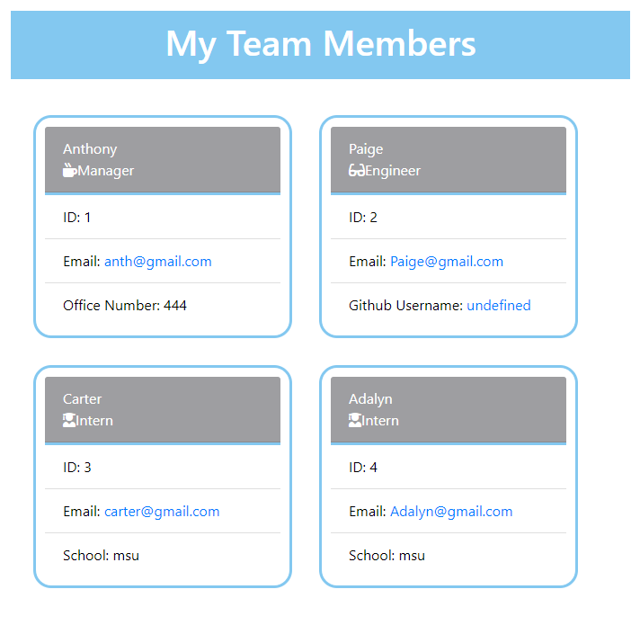

# Group Profile Generator

  

## Table of Contents

  * [Description](#description)
  * [Installation](#installation)
  * [Usage](#usage)
  * [License](#license)
  * [Contributers](#contributers)
  * [Tests](#tests)
  * [Questions](#questions)
  

  ## [Description:](#table-of-contents)

  #### This app was made to list all the employees at a work place. There is questions that are asked based on which role the employee is in and then the answer are then displayed on a html page for a layout of the team members.

  ## [Installation](#table-of-contents)

  #### Node and Inquirer were used to make this app.

  ## [Usage](#table-of-contents)

  #### When using this app, you will open the terminal, enter node index, and then anwser the following questions to then generate a html page of all the team members.
  #### Click [Here](https://drive.google.com/file/d/1GAwRJT2qFjsLkWgDAe348eDojscq2kPQ/view) for a walkthrough video of how it works.

  

  
  ## License
    
  The application is covered under the following license:
    
  
  
    

  ## [Contributers](#table-of-contents)

   * Paige Caiozzo

  ## [Tests](#table-of-contents)

  #### To run a test, open the terminal and enter npm run test. It will then dusplay if the test has passed or failed.

  ## [Questions](#table-of-contents)

If there are further questions, pleasae contact me:
  

  * [GitHub](http://github.com/pcaiozzo)

  * [Email:](mailto:angelagola.ko@gmail.com)
